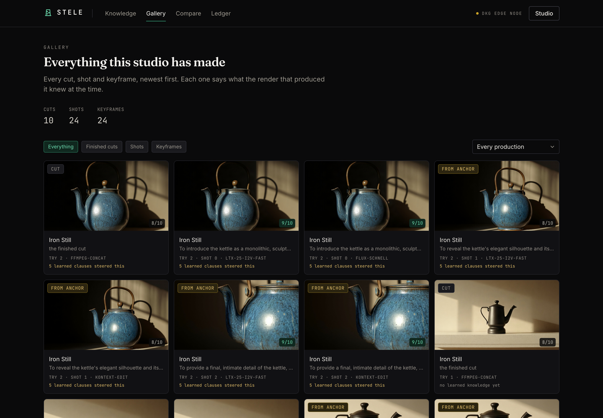
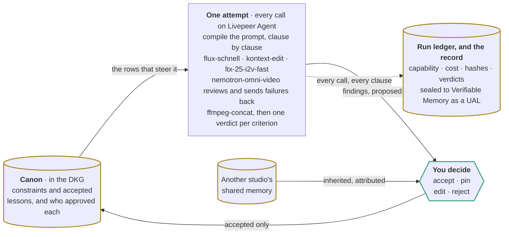
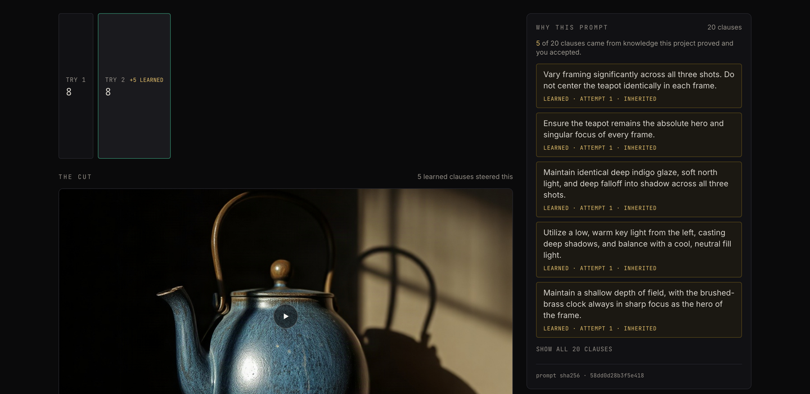
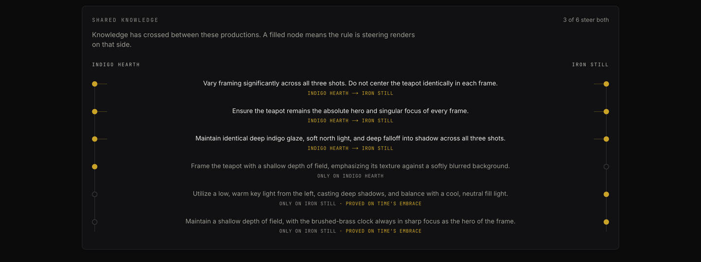
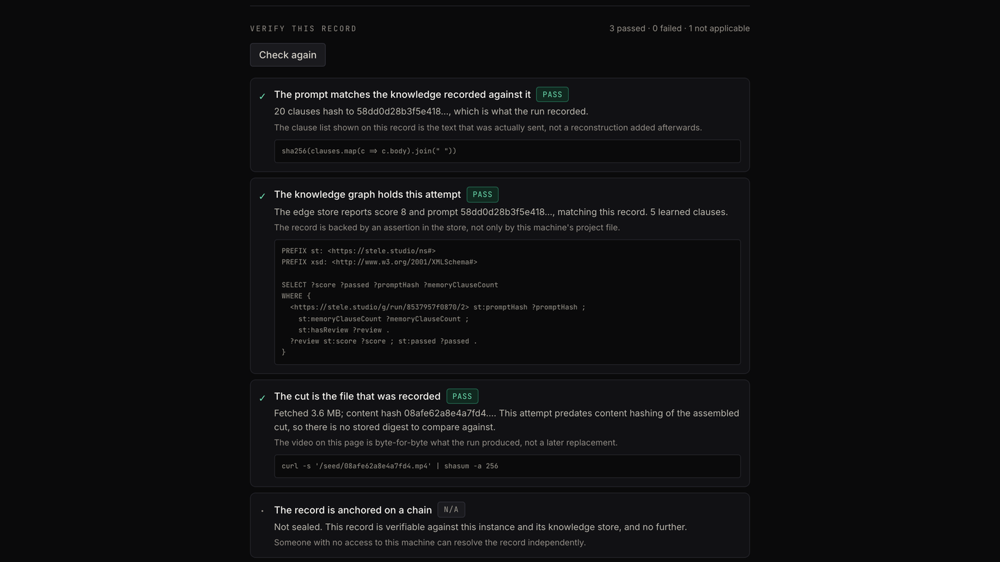
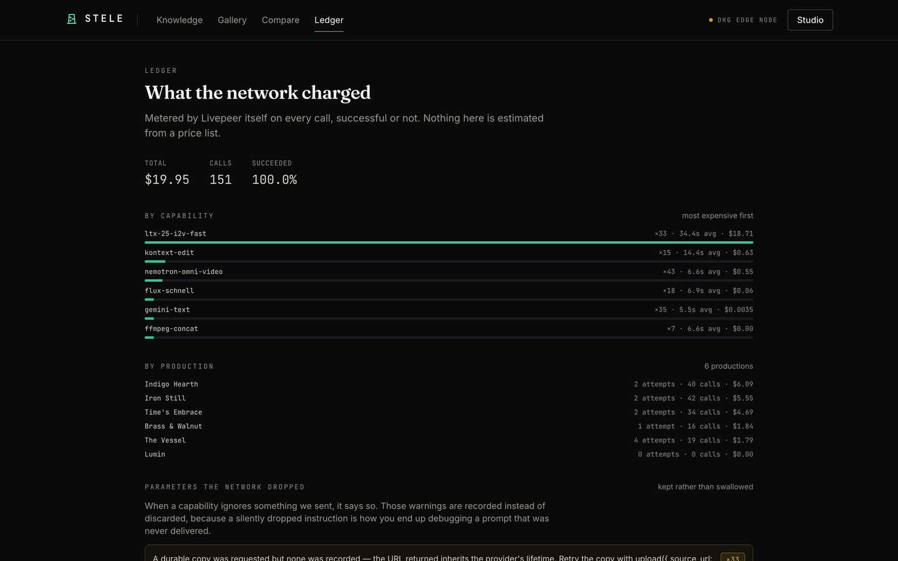
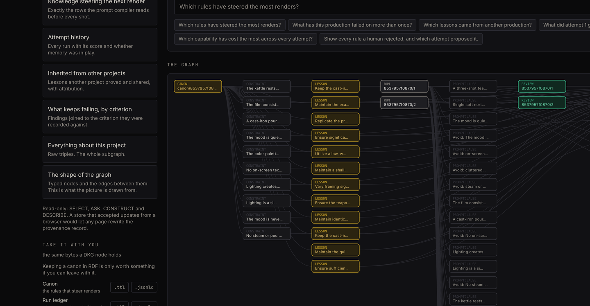
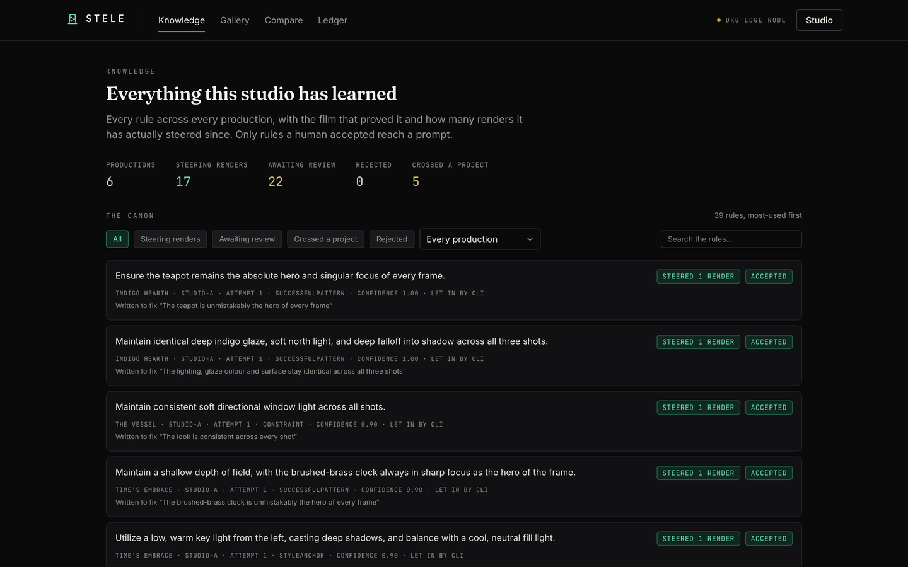

<div align="center">

<picture>
  <source media="(prefers-color-scheme: dark)" srcset="docs/brand/wordmark-dark.svg" />
  
</picture>

**An AI studio whose memory and its receipts are the same verifiable knowledge graph.**

*Livepeer Agent Hackathon 2026 — **Track 2: Livepeer Agent + OriginTrail DKG***

**[Watch the demo](https://youtu.be/ajfEWku-Rmw)** &nbsp;·&nbsp; **[Open the live record](https://stele-record.vercel.app)** &nbsp;·&nbsp; [The evidence](#evidence) &nbsp;·&nbsp; [What the knowledge actually does](#track-2-what-the-knowledge-actually-does) &nbsp;·&nbsp; [Run it yourself](#run-it) &nbsp;·&nbsp; [Limitations](#limitations)

</div>

| Go straight to | |
|---|---|
| **The claim, shown** | [A prompt compiled from the graph, clause by clause](#1-the-prompt-is-compiled-from-the-graph-and-every-clause-knows-where-it-came-from) |
| **The claim, tested** | [A control run with memory withheld](#the-control) &nbsp;·&nbsp; [An experiment that failed, and what it changed](#the-experiment-that-failed-and-what-it-taught) |
| **Knowledge moving between agents** | [Measured across a project boundary](#knowledge-crossing-a-project-boundary-measured) |
| **Checkable, not assertable** | [Every record re-derived from scratch](#3-every-production-leaves-a-record-someone-else-can-check) |
| **The DKG, and what is real** | [Running against a live edge node](#the-dkg-node) &nbsp;·&nbsp; [What never reaches the graph](#what-never-reaches-the-graph) |
| **Livepeer Agent** | [Every capability, and what each one does](#how-livepeer-agent-is-used) |
| **The Knowledge Asset** | [Create, retrieve and verify, end to end](#the-knowledge-asset-end-to-end) |
| **Where it could go** | [What is missing, and what it would take](#where-this-goes) |
| **Reproduce it** | [Setup from a clean clone](#run-it) &nbsp;·&nbsp; [Live instance health](https://stele-record.vercel.app/api/health) |
| **See it running** | [The demo video](https://youtu.be/ajfEWku-Rmw), recorded against a live OriginTrail Edge Node |

---

<sup>The hosted demo is the record, read only: it can show you everything six productions learned, but a render writes to disk and talks to a DKG node, so producing a film means [running it locally](#run-it). The header on every page states which knowledge store that instance resolved to, and links to the report.</sup>



<sup>Everything this instance has rendered. Each frame carries the capability that made it, the attempt it belongs to, the score a model gave it after watching, and how many learned clauses were steering at the time. Nothing on the site is stock footage, which for a project about provenance seemed like the minimum.</sup>

## The problem

You got the shot once. Then you never got it again.

Forty prompts in, something finally lands. You could not say which word did it. Two days later you
need one more shot that matches, and you are back at prompt one. Every tool you have used forgets —
and the file you walk away with cannot tell anyone what made it, from what, or under whose direction.

Stele fixes both halves with one mechanism. What a production learns is written to the OriginTrail
DKG as knowledge you own, and that same knowledge is what compiles the next prompt. The record that
steers the work and the record that proves it are the same graph.

## What it does

Give it a brief and the criteria it must satisfy. Then, per attempt:

| | Stage | What happens |
|---|---|---|
| 1 | **Compile** | SPARQL over the DKG returns this production's constraints and accepted lessons. Each row becomes one clause of the prompt. |
| 2 | **Plan** | The shot list is written against the compiled knowledge, not the raw brief. |
| 3 | **Render** | The first shot sets the film's anchor frame; every later keyframe is an edit of it, then animated. |
| 4 | **Gate** | A video-understanding model *watches* each shot and scores it per criterion. A rejected shot is re-rendered with the reason attached. |
| 5 | **Assemble** | Shots cut together, narration and score laid over, all on the network. |
| 6 | **Review** | The finished cut is watched and scored against every criterion. |
| 7 | **Learn** | Findings become rules for next time — and wait. Nothing steers a render until a human accepts it. |

Everything above runs on Livepeer Agent. There is no second AI vendor anywhere in the system.



Two things in that diagram carry the argument: **the canon is read before every render and written
only by a human**, and **everything the loop does lands in the ledger**, which is what the production
record and the seal are built from.

## Track 2: what the knowledge actually does

The hackathon asks whether verifiable knowledge *materially improves* the application. Three
specific answers, each checkable.

### 1. The prompt is compiled from the graph, and every clause knows where it came from

This is the whole design. A prompt here is not a string that gets appended to — it is a list of
**clauses**, and each clause keeps the identity of the constraint or lesson it came from, the
attempt that learned it, and the criterion it was meant to fix.

```ts
CompiledPrompt {
  text: string;
  clauses: Array<{ body, role, sourceKind, sourceIri, sourceAttempt, criterionIndex }>;
}
```

The workshop for this track made the point plainly: a higher score does not prove memory caused the
improvement — you have to look at the knowledge the next prompt actually used. The studio's
**"Why this prompt"** panel is that look, and it is a join over the graph rather than a view of
local state.

If the DKG returns nothing, the prompt is the brief alone and the score drops. That is the
material improvement, and the control run below measures it.

### 2. Knowledge crosses project boundaries, with attribution

A rule proved on one film is worth something on the next one — and on a colleague's. Accepted
lessons are promoted to **Shared Working Memory**, where another production finds them by query.

Measured on the live node: a `studio-b` production about a **cast-iron kettle** adopted five rules
`studio-a` had proved on a **teapot** and a **clock**, and two criteria it had been failing became
met — at 20% lower cost. The numbers are under [Evidence](#evidence).

Each rule arrives with the name of the film that proved it, the studio that owns it, and a confidence
discounted for travelling, and lands as a proposal subject to the same human review as anything
learned locally.

This is the part a JSON file cannot fake, and it is why the memory is a graph.

### 3. Every production leaves a record someone else can check

Two Knowledge Assets per project, written as RDF and cumulative per attempt:

**Run Ledger** — what happened. Attempt number, the capability that rendered each artifact, content
hashes, the reviewer's verdict per criterion, cost, and every prompt clause joined to the knowledge
it was compiled from.

**Canon** — what should steer the next attempt. Constraints decomposed from the brief and lessons
the loop proposed, each carrying its status, its confidence, the attempt that learned it, the
criterion it addresses, and who accepted it.



<sup>Attempt 2 of *Iron Still*. Five of its twenty prompt clauses came from rules another production proved, each tagged with the attempt that learned it. The sha256 underneath is of the assembled clause list, which is what makes the claim checkable rather than decorative.</sup>



<sup>Knowledge crossing a boundary. A row spanning both rails is a rule steering both films; a row reaching one is unique to it. Three came from *Indigo Hearth*, and two of those reached *Iron Still* by way of a third production, *Time&rsquo;s Embrace*.</sup>

### The Knowledge Asset, end to end

The track asks for the asset and its create, retrieve and verify path. All three, in one place.

**The asset.** Two per project, both RDF, both cumulative across attempts. Named by content so a
rewrite is a new asset rather than a silent edit of an old one:

```
stele-<projectId>-canon-<sha256[0:10]>        the rules that steer the next render
stele-<projectId>-run-ledger-<sha256[0:10]>   what every attempt did, cost and hashed
```

**Create.** [`src/dkg/serialize.ts`](src/dkg/serialize.ts) turns project state into Turtle, every
literal passes [`src/dkg/redact.ts`](src/dkg/redact.ts), and
[`src/dkg/client.ts`](src/dkg/client.ts) writes it through the node's own CLI. `--share` is what
promotes it from the node's private Working Memory into Shared Working Memory, where peers on the
context graph can read it:

```bash
dkg ka create  stele-<id>-canon-<digest> -c <context-graph> --input-file canon.ttl --share
dkg ka status  stele-<id>-canon-<digest> -c <context-graph> --json
```

Re-running is safe: an existing asset is written and finalised instead, and the CLI is the write
path specifically because `--share` is not exposed anywhere else.

**Retrieve.** Reads are SPARQL against the running node, not the CLI, because `dkg query` renders a
formatted table with no `--json` and parsing it returns zero rows that look exactly like an empty
graph. `includeSharedMemory` is the flag that makes another agent's shared lessons visible here, and
it is the mechanism behind cross-project inheritance:

```bash
curl -s http://127.0.0.1:9200/api/query \
  -H "authorization: Bearer $(cat ~/.dkg/auth.token)" \
  -H "content-type: application/json" \
  -d '{"sparql":"SELECT ?s ?p ?o WHERE { ?s ?p ?o } LIMIT 20",
       "contextGraphId":"<context-graph>","includeSharedMemory":true}'
```

Every query the product runs is in [`src/dkg/queries.ts`](src/dkg/queries.ts), and the studio's
**Knowledge graph** tab will run any of them, or one you write, against your own node.

**Verify.** Open any production record and press **Run the checks**. Four checks, each re-derived
from scratch rather than read back from application state, and each printing the command that
reproduces it without this app:

| Check | How it is re-derived |
|---|---|
| The prompt matches the knowledge recorded against it | `sha256(clauses.map(c => c.body).join(" "))`, recomputed from the clause list on the page |
| The knowledge graph holds this attempt | A SPARQL `SELECT` against the node for that run's score, prompt hash and memory clause count |
| The cut is the file that was recorded | `curl -s <cutUrl> \| shasum -a 256` against the stored digest |
| The record is anchored on a chain | `dkg ka query <ual>` |

The fourth reports **not applicable** on this instance rather than passing, because nothing here has
been sealed to Verifiable Memory. See [Limitations](#limitations).

### What is local, what is shared, what is published

| Layer | Holds | In this project |
|---|---|---|
| **Working Memory** | The node's own drafts | Every assertion starts here |
| **Shared Working Memory** | Gossiped to context-graph peers | Both assets, on every write — this is what cross-project inheritance reads |
| **Verifiable Memory** | Anchored on chain, carries a UAL | Only on an explicit **Seal**, never automatically |

Sealing is a deliberate act because it costs gas and cannot be undone. You seal a cut you are
willing to stand behind.

### What never reaches the graph

Only four kinds of thing are written: references the network already hosts, hashes, numbers, and
short reviewable findings. Prompts travel as SHA-256 hashes, never verbatim.

`src/dkg/redact.ts` is the gate every literal passes through — it scrubs credentials, emails, phone
numbers, wallet material and local filesystem paths, and bounds every string. `assertSafe` runs over
the assembled Turtle before it leaves the process and **fails the write** rather than publishing
something that looks like a secret. Media references are allowlisted to hosts the media network
owns, with query strings stripped, because a provenance record that points somewhere unexpected is
worse than one that admits it has no pointer.

## How Livepeer Agent is used

Livepeer Agent is not a component of this system — it is the entire compute layer. Reasoning,
generation, **video understanding**, audio and editing all dispatch to it.

| Stage | Capability | Notes |
|---|---|---|
| Reasoning — intake, shot planning, lesson distillation | `gemini-text` | ~$0.0001/call, p50 2.1s. Cheap enough to sit inside a loop |
| Grounding a brief in a real page | `obscura-extract-text` | Only the URL, time and a content hash are kept |
| Anchor keyframe | `flux-schnell` | Prompt-only; it declares no `aspect_ratio` |
| Later keyframes | `kontext-edit` | Edits the anchor, so subject and light carry structurally |
| Shots | `ltx-25-i2v-fast` | Animates each keyframe |
| **Review gate** | `nemotron-omni-video` | Watches the clip. Returns a per-criterion verdict |
| Narration | `inworld-tts` | |
| Score | `sonilo-v2m` | |
| Cut, audio, reframe | `ffmpeg-concat`, `ffmpeg-mux`, `ffmpeg-audio-mix`, `ffmpeg-reframe` | No local ffmpeg — nothing to install |

Two rules the client holds itself to, both mirroring the surface's own design:

- **A capability name is a contract.** Parameters are validated against what the network declares
  before dispatch, and the `warnings` it returns — such as a parameter a provider silently ignored —
  are surfaced in the UI rather than swallowed. Nothing is ever re-routed to a sibling model.
- **Cost is measured, not estimated.** The ledger is built from the network's own
  `cost_usd_estimated`, so the figure on screen is what was billed.

> **Correction to the published docs:** the Get Started page prints the tool-profile header as
> `X-Livepeer Agent-Tool-Profile`. That contains a space, which is not a legal HTTP field name — a
> spec-compliant client throws before the request leaves. The hyphenated form works.



<sup>Every claim on a production record re-derived from scratch. Each check prints the command or query that reproduces it without this app, and the fourth reports N/A rather than passing, because this attempt was never sealed to a chain.</sup>



<sup>Every call the studio has ever made, priced by Livepeer itself rather than estimated here. Failed calls are listed and still billed, because that is what happened.</sup>

## Evidence

Everything below came from real runs against the live network and a real DKG node. Nothing is
reconstructed, and the results that went the wrong way are here too — a project whose central claim
is "verifiable knowledge improves the output" has no business reporting only the runs that agreed.

### The experiment that failed, and what it taught

The first honest test of the core claim was a three-shot product film, target 8.

| Attempt | Learned clauses | Score | Criteria unmet |
|---|---|---|---|
| 1 | 0 | **7**/10 | consistency, object identity |
| 2 | 4 | **5**/10 | consistency, object identity |

Memory made it **worse**. The reviewer said why: across the three shots the clock face went from
black Roman numerals to white Arabic, the surface from wood to walnut to dark wood, the light from
bronze to sunlit to high-contrast.

Every accepted lesson was about exactly that — *"keep the lighting setup identical across all three
shots"*, *"depict the clock face with the same design in every shot"*. The lessons were right. The
pipeline could not obey them, because each shot was an independent text-to-image render followed by
image-to-video, with nothing carried between them. Told to hold something constant, the generator
had nothing to hold.

**Consistency turned out to be a conditioning problem, not a prompt problem.** The first shot now
establishes an anchor frame, and every later keyframe is produced from it with `kontext-edit`, whose
stated purpose is preserving the source subject. Same brief, run cold again:

| | Learned clauses | Score | Criteria unmet |
|---|---|---|---|
| Before the fix | 0 | 7/10 | consistency, object identity |
| **After the fix** | 0 | **8**/10 | **none** |

The measurement changed the architecture. That is the useful part of having one.

### The experiment that worked

With consistency handled structurally, a harder brief — a four-criterion teaser, target 9 — left the
loop something a prompt could actually fix.

| Attempt | Learned clauses | Score | Per-criterion |
|---|---|---|---|
| 1 | 0 | **7**/10 | hero ✓ · consistency ✓ · **distinct framing ✕** · mood ✓ |
| 2 | 4 | **8**/10 | hero ✓ · **consistency ✕** · **distinct framing ✓** · mood ✓ |

Attempt 1's reviewer: *"All three shots use nearly the same centered composition, so they feel like
repeated angles rather than different framings."*

The highest-confidence lesson distilled from it: *"Vary framing significantly across all three shots.
Do not center the teapot identically in each frame."*

Attempt 2's reviewer, on that same criterion: *"Framing changes from close-up to medium to wide shot,
clearly distinct angles."*

The lesson that targeted the failure fixed the failure, and the score rose. **It is not a clean win:**
consistency regressed from met to unmet — *"glaze appears slightly warmer in first shot due to direct
sunlight"* — and the attempt cost $3.67 against $2.42, because shots needed re-renders. The loop
trades; it does not monotonically improve. That is worth knowing, and it is the kind of thing a
provenance record is for.

### Knowledge crossing a project boundary, measured

The distinctive Track 2 claim is that a rule proved on one production is worth something on another.
Showing that a second studio *can discover* the first one's lessons is half an argument. This is the
other half.

A different studio identity (`studio-b`), a different subject — a cast-iron kettle, where `studio-a`
had been filming a teapot and a clock. Briefed cold, then briefed again after adopting five rules
that `studio-a` had proved and a human had accepted, with nothing else changed.

| | Inherited clauses | Score | Per-criterion |
|---|---|---|---|
| Cold | 0 | 8/10 | hero ✓ · **consistency ✕** · **framing ✕** · mood ✓ |
| **Warm** | **5**, all from another project | 8/10 | hero ✓ · **consistency ✓** · **framing ✓** · mood ✓ |

Both failing criteria flipped. The reviewer on the warm run: *"Each shot uses a distinct framing:
wide, medium, and close-up"* — the criterion `studio-a`'s highest-confidence lesson was written to
fix, on a subject `studio-a` never filmed.

It also ran **$3.08 → $2.46, about 20% cheaper**, because fewer shots needed re-rendering. Knowledge
that transfers pays for itself twice.

**The headline score did not move.** Both runs scored 8 against a target of 9, and the reviewer's
summary on the warm run still called the shots "very similar in composition" while marking that same
criterion met — the model is not perfectly self-consistent. The per-criterion verdicts moved; the
single number did not. Both are reported because the single number is the one that flatters us less.

**A real limitation this exposed:** inherited lessons arrive in their origin's vocabulary — *"maintain
identical deep indigo glaze"* steering a film about a cast-iron kettle. The general principle
transferred anyway, but generalising a rule as it crosses a project boundary is unfinished work, and
it is listed as such below.

### The control

Claiming memory helped is easy when you only publish the runs that improved. So the studio has a
**Run control** button: the same brief, the same criteria, the same reviewer, with every learned
lesson withheld at compile time — one variable changed.

Run on a **single-shot** project, the control scored **8/10**, exactly matching the memory-steered
attempt beside it. No effect. The design was too weak to show one either way: with one shot, "the
look is consistent across every shot" is trivially satisfied, and every lesson in that canon was
about cross-shot consistency. A control has to exercise the thing it is controlling for.

It is reported here because it ran, and a control you only publish when it flatters you is not a
control.

### The DKG node

```
Node:      stele-node          Role:  edge
Network:   DKG V10 Base Testnet (base:84532)
Peers:     6                   Relay: connected
Store:     oxigraph-worker
```

A Knowledge Asset created and promoted to Shared Working Memory on that node:

```
Status:         swm-shared
Assertion URI:  did:dkg:context-graph:0xd4c8…/stele-studio/_shared_memory/0xd4c8…/0
Merkle root:    0xbecfe126d8476907e899e4327434e1d852eb90b0a4c848b50c3bfd767c538b2c
```

The prompt compiler, reading that node: **19 clauses, 4 learned** in the normal condition,
**5 clauses, 0 learned** with memory withheld.



<sup>Ask the graph in English and read the SPARQL it wrote before you run it. Read-only by construction: a store that accepted updates from a browser would let any page rewrite the provenance record.</sup>



<sup>The canon across every production. A rule carries the film that proved it, the finding it was written to fix, and how many renders it has actually steered since, so a rule nobody uses cannot hide among rules that work.</sup>

## Run it

**Node 22.13 or newer. Nothing else.** No API key, no account, no environment file, no database,
and nothing to install beyond the dependencies. Windows, macOS and Linux are all fine: every script
is plain Node, the knowledge store in the default mode is an in-process WebAssembly build of
oxigraph, and the only native tools the project uses, FFmpeg among them, run on Livepeer rather than
on your machine.

```bash
git clone https://github.com/TusharTechs/stele.git
cd stele
npm install
npm run dev
```

On Windows, run those in **PowerShell, Command Prompt, or WSL**; all three work. Then open
<http://localhost:3210>.

| | |
|---|---|
| **Node** | 22.13.0 or newer, which `package.json` enforces. `node --version` to check, [nodejs.org](https://nodejs.org) to install. |
| **Disk** | About 560MB once installed: 49MB of repo, most of it the demo footage that ships so the studio is not empty on first run, and roughly 510MB of dependencies. |
| **Network** | Outbound HTTPS to `agent.livepeer.org`. Nothing listens except the dev server on port 3210. |
| **Ports** | 3210 for `npm run dev`. `npm start` reads `PORT`, so a host that assigns one is handled. |

The six demo productions load themselves before the dev server starts, so the first thing you see is
finished work rather than an empty studio.

Write a brief, press **Run first attempt**, accept a lesson or two in the **Canon** tab, then run
again. A three shot attempt takes three to five minutes and costs about $1.76, charged to Livepeer's
keyless demo allowance rather than to you.

> The in-process store runs the *same SPARQL* as the real thing, so the loop is genuine. It is
> **not** evidence of a DKG integration, and the app says so on every page and in `/api/health`.

**With a real DKG node** — the Track 2 path:

```bash
npm install -g @origintrail-official/dkg
dkg init --network testnet --role edge --store oxigraph   # testnet wallets are auto-funded
dkg start
dkg context-graph create stele-studio

echo 'STELE_DKG=edge' >> .env.local
npm run dev
```

The header badge changes from `LOCAL RDF` to `DKG · EDGE NODE`, and `/api/health` reports the
resolved store, the context graph, and whether the daemon actually answers a query.

**Sealing to Verifiable Memory** additionally needs `STELE_DKG=network` and gas in the node's
operational wallet (`dkg wallet`).

Drive the engine without a browser:

```bash
npm run run:cli -- --shots 1                       # a new project, one shot
npm run run:cli -- --project <id> --accept         # accept every lesson, then run again
npm run run:cli -- --project <id> --control        # the control condition
```

**Verify the capability claims yourself**, no account needed. Open
<http://localhost:3210/api/health> in a browser for the resolved stores and a live probe of the
network, and read [`src/livepeer/capabilities.ts`](src/livepeer/capabilities.ts) for the capability
map and [`src/livepeer/mcp-client.ts`](src/livepeer/mcp-client.ts) for the single endpoint every
call goes through.

From a terminal, if you prefer:

```bash
npm run typecheck && npm run lint && npm test
```

```bash
# macOS or Linux
grep -rn "agent.livepeer.org" src/livepeer/
```

```powershell
# Windows PowerShell
Select-String -Path src\livepeer\*.ts -Pattern "agent.livepeer.org"
```

## Limitations

Stated plainly, because a reader should be able to tell a working path from a planned one.

- **No UAL yet.** The node is on testnet and holds 1000 TRAC per wallet, but the faucet's own wallet
  was out of Base Sepolia ETH, so it funded TRAC and no gas. Sealing to Verifiable Memory is
  implemented and wired end to end — `dkg ka publish`, UAL and tx-hash parsing, the seal record, the
  production-record page — but it has **not been executed against the chain**. Everything shown above
  ran on Working and Shared Working Memory, which the rules permit.
- **A single-shot film makes one criterion meaningless.** "Consistent across every shot" is degenerate
  with one shot, and the reviewer will sometimes describe a cut between shots that does not exist.
  Use three or more shots for a meaningful run.
- **The reviewer is one model's opinion.** It is consistent enough to steer a loop and specific enough
  to act on, but it is not a panel of humans, and a score should be read as a signal, not a grade.
- **Shot retries are bounded at two.** A shot that still fails is kept rather than discarded — its
  footage is usually usable and its failure is what the next attempt learns from.
- **The node's SPARQL engine returns nothing for `UNION`.** Both queries that needed one are written
  over `VALUES` and `OPTIONAL` instead. If you add a query, avoid `UNION` and check it against both
  stores.
- **Inherited lessons keep their origin's vocabulary.** A rule proved on a teapot arrives saying
  "deep indigo glaze" even when it is steering a film about a kettle. The principle transferred and
  the criteria passed, but generalising a rule as it crosses a project boundary is not implemented.
- **No authentication.** Anyone who can reach the port can run productions and spend credits. It is a
  local studio, not a deployed service.
- **Narration and score are mutually exclusive.** `ffmpeg-mux` replaces a clip's audio rather than
  mixing into it, so laying both down would silently discard the narration.

## Where this goes

The loop works and the knowledge crosses projects. What it is not yet is a thing other people can
rely on, and the gap is specific rather than vague.

**Seal for real.** Everything for Verifiable Memory is written and wired. It needs gas in the
operational wallet and one successful `dkg ka publish`, after which `/record/<id>` resolves for
someone with no access to the machine that made the film. That single step converts the strongest
claim here from implemented to demonstrated, and it is the first thing to do.

**Generalise a rule as it crosses a boundary.** Today an inherited lesson arrives in the vocabulary
of the film that proved it, saying "deep indigo glaze" while steering a kettle. The principle
transfers and the criteria pass, but a rule that abstracted itself on the way over would transfer
further and to more distant work. This is a distillation problem, not an infrastructure one, and the
graph already carries everything needed to attempt it.

**A canon worth subscribing to.** Shared Working Memory already lets one studio read another's
accepted rules. The missing piece is social rather than technical: a way to follow a canon, see what
it has proved and at what cost, and take rules from it without taking all of them. A house style
somebody else maintains and you inherit is a more interesting object than a folder of prompts, and
it is the version of this that could matter beyond one machine.

**Reviewers you can disagree with.** One model's score steers the loop today. Two reviewers that
disagree is more useful information than one that is confident, and the verdict schema already
stores per-criterion judgements, so recording several and surfacing the disagreement is additive
rather than a rewrite.

**The honest boring work.** Authentication before this is ever hosted with a key attached, a spend
ceiling per day rather than per attempt, and resumable runs so a dropped connection does not cost a
render. None of it is interesting and all of it is required before anyone else's money is involved.

## How it is built

```
src/livepeer/   mcp-client.ts    JSON-RPC over HTTP, session threading, job polling, the call ledger
                capabilities.ts  Which capability does which job, and its verified parameter contract
src/dkg/        ontology.ts      The stele: vocabulary
                serialize.ts     Project state → the two Knowledge Assets, as Turtle
                queries.ts       The SPARQL that changes what the app does
                client.ts        Three stores behind one interface: network, edge, file
                redact.ts        The gate every literal passes through
src/core/       compiler.ts      Graph rows → prompt clauses, with provenance kept
                reviewer.ts      The video-understanding gate
                distiller.ts     Findings → rules for next time
                pipeline.ts      The run loop, resumable stage by stage
src/app/        /                the case, argued with two real cuts
                /studio/[id]     the console: production, canon, graph
                /record/[id]     the production record
```

Next.js 16 · React 19 · TypeScript (strict) · Tailwind v4 · zod · oxigraph.

Runs as a persistent Node process, not serverless: a video render takes minutes and every stage
persists before the next begins, so an interrupted run re-enters where it stopped rather than paying
to redo it.


## The demo

**[Watch it here](https://youtu.be/ajfEWku-Rmw)**

Recorded against an instance running on a live OriginTrail Edge Node, which is what the badge in the
header of every frame reports. That matters, because the hosted copy below cannot reach a DKG node
and says so; the video is where the Track 2 path is visible without installing the node yourself.

The narration was synthesised by `inworld-tts` on Livepeer, which seemed like the right way to voice
a submission about the network it runs on.

## The hosted copy, and the real thing

Two ways in, doing different jobs.

**[stele-record.vercel.app](https://stele-record.vercel.app)** is the record, read only. Every page
that reads works: six productions, the canon behind them, the gallery, the comparison between two
films, the ledger of what each call cost, and a verification panel that re-derives every claim. It
loads instantly and nothing there can be changed.

**Making a film means running it yourself**, and that is a deliberate property rather than a missing
feature. A render takes minutes against a serverless function timeout, writes project files to disk,
and talks to a knowledge store on localhost. None of those survive a serverless host.

```bash
git clone https://github.com/TusharTechs/stele.git
cd stele
npm install
npm run dev
```

That is the whole setup. **No environment file is needed and no key is required**: the studio runs
on Livepeer's keyless demo allowance, so pressing **Run first attempt** renders, reviews and scores
a real film without an account. One 3-shot attempt costs about **$1.76** of metered network spend
against an allowance capped per address, so there is room for several before it runs out.

Everything below is optional, and only matters for the two things the default cannot do.

| Variable | Set it to | What it changes |
|---|---|---|
| `LIVEPEER_API_KEY` | a key from [agent.livepeer.org](https://agent.livepeer.org/get-started.html) | Lifts the keyless allowance cap. Nothing else. The capabilities and prices are identical either way. |
| `STELE_DKG` | `edge` | Knowledge is written to a real OriginTrail Edge Node instead of the in-process store. This is the Track 2 path, and the header changes from **local RDF store** to **DKG · edge node**. Needs the node installed and running, see [Run it](#run-it). |
| `STELE_DKG` | `network` | The same, plus sealing a production to Verifiable Memory for a UAL. Needs gas in the node's operational wallet. |
| `STELE_RUN_BUDGET_USD` | a number | Ceiling for one attempt. A stage that would cross it stops the run rather than spending through. Defaults to 8. |
| `STELE_READ_ONLY` | `1` | Disables everything that writes, with an explanation in place of a dead button. Detected automatically on Vercel; set it by hand anywhere else you want a read-only copy. |

The in-process default is real SPARQL over the same ontology, so the learning loop is genuine
without any of this. It is **not** evidence of a DKG integration, and the app says so on every page
and in `/api/health`.

## License

[Apache-2.0](LICENSE).
