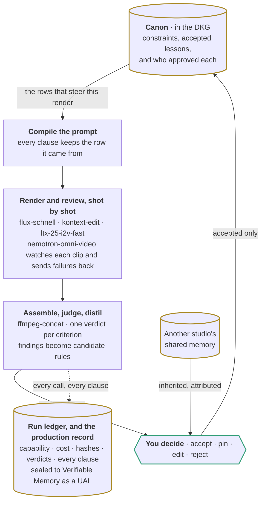

<!--
  Themed by GitHub, not by us.

  This carried a full `themeVariables` block pinned to the product's dark palette, which overrode
  the light/dark theme GitHub picks for a reader and rendered the whole thing as a black slab on a
  white README. Only the two accent strokes are set now, at values that clear 3:1 on both #ffffff
  and #0d1117, so fills and type follow whichever theme the reader is on.

  It is also about a third shorter. A linear pipeline drawn top to bottom grows without limit, so
  the stages that the README's table already walks through one by one are folded into the boxes
  they belong to, and what is left is the shape of the thing: a cycle through a graph, with a person
  standing in it.
-->

