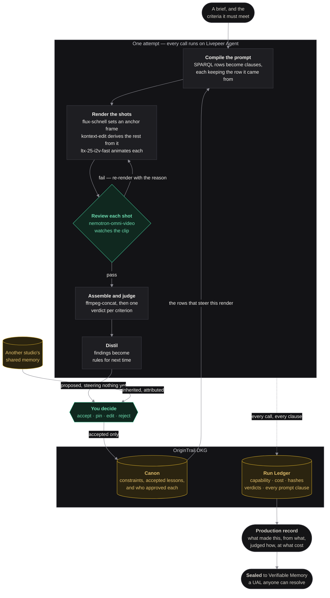

```mermaid
%%{init: {"theme":"base","themeVariables":{
  "fontFamily":"ui-sans-serif, system-ui, -apple-system, sans-serif","fontSize":"14px",
  "primaryColor":"#1e1e22","primaryTextColor":"#f4f2ee","primaryBorderColor":"#3a3a42",
  "lineColor":"#8a8a92","textColor":"#d6d2ca",
  "clusterBkg":"#131316","clusterBorder":"#3a3a42","edgeLabelBackground":"#131316"}}}%%
flowchart TB
    BRIEF(["A brief, and the<br/>criteria it must meet"])

    subgraph LOOP["One attempt — every call runs on Livepeer Agent"]
        direction LR
        COMPILE["<b>Compile the prompt</b><br/>SPARQL rows become clauses,<br/>each keeping the row it came from"]
        RENDER["<b>Render the shots</b><br/>flux-schnell sets an anchor frame<br/>kontext-edit derives the rest from it<br/>ltx-25-i2v-fast animates each"]
        GATE{"<b>Review each shot</b><br/>nemotron-omni-video<br/>watches the clip"}
        CUT["<b>Assemble and judge</b><br/>ffmpeg-concat, then one<br/>verdict per criterion"]
        DISTIL["<b>Distil</b><br/>findings become<br/>rules for next time"]
    end

    HUMAN{{"<b>You decide</b><br/>accept · pin · edit · reject"}}

    subgraph GRAPH["OriginTrail DKG"]
        direction LR
        CANON[("<b>Canon</b><br/>constraints, accepted lessons,<br/>and who approved each")]
        LEDGER[("<b>Run Ledger</b><br/>capability · cost · hashes<br/>verdicts · every prompt clause")]
    end

    OTHER[("Another studio's<br/>shared memory")]
    RECORD(["<b>Production record</b><br/>what made this, from what,<br/>judged how, at what cost"])
    SEAL(["<b>Sealed</b> to Verifiable Memory<br/>a UAL anyone can resolve"])

    BRIEF --> COMPILE
    COMPILE --> RENDER --> GATE
    GATE -->|"pass"| CUT --> DISTIL
    GATE -->|"fail — re-render with the reason"| RENDER

    CANON -->|"the rows that steer this render"| COMPILE
    DISTIL -->|"proposed, steering nothing yet"| HUMAN
    OTHER -->|"inherited, attributed"| HUMAN
    HUMAN -->|"accepted only"| CANON

    LOOP -.->|"every call, every clause"| LEDGER
    LEDGER --> RECORD --> SEAL

    classDef knowledge fill:#2b2410,stroke:#c9a227,color:#e0bd6a
    classDef gate fill:#10281f,stroke:#3fbf92,color:#6ddcb0
    classDef terminal fill:#141416,stroke:#3a3a42,color:#d6d2ca
    class CANON,LEDGER,OTHER knowledge
    class GATE,HUMAN gate
    class BRIEF,RECORD,SEAL terminal
```
