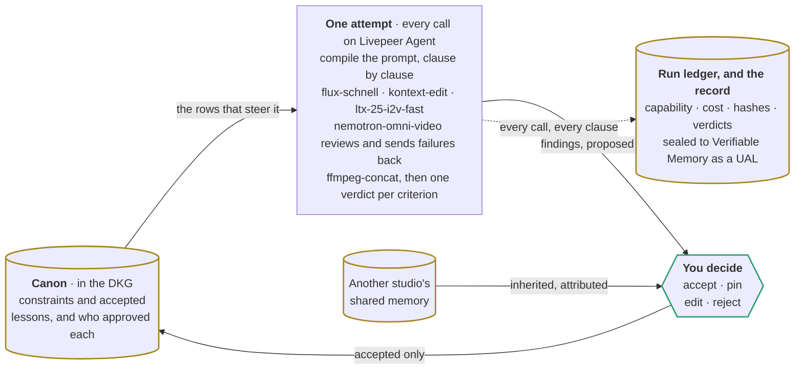

<!--
  Sized for the page it is read on, and themed by whoever is reading it.

  Two things were wrong with the first version. It pinned a full `themeVariables` block to the
  product's dark palette, which overrode the light/dark theme GitHub picks per reader and rendered
  the whole diagram as a black slab on a white README. Only the two accent strokes are set now, at
  values clearing 3:1 on both #ffffff and #0d1117, so fills and type follow the reader.

  And it was drawn top to bottom, which for a linear pipeline grows without limit. The trap is that
  shrinking the source does nothing: GitHub stretches the SVG to the width of the README column, so
  the rendered height is set by the aspect ratio alone. A narrower diagram is a taller one. Measured
  at a 950px column, the portrait version came out about 1800px tall; this one is 1129 by 520 and
  renders at 950 by 438, with the type still large enough to read.

  Getting there meant folding the stages that the table above already walks through one by one into
  the single box they belong to. What is left is the shape that carries the argument: a cycle
  through a graph, with a person standing in it.
-->

